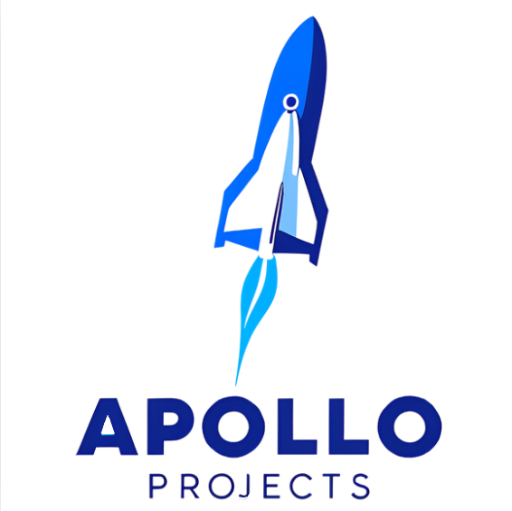
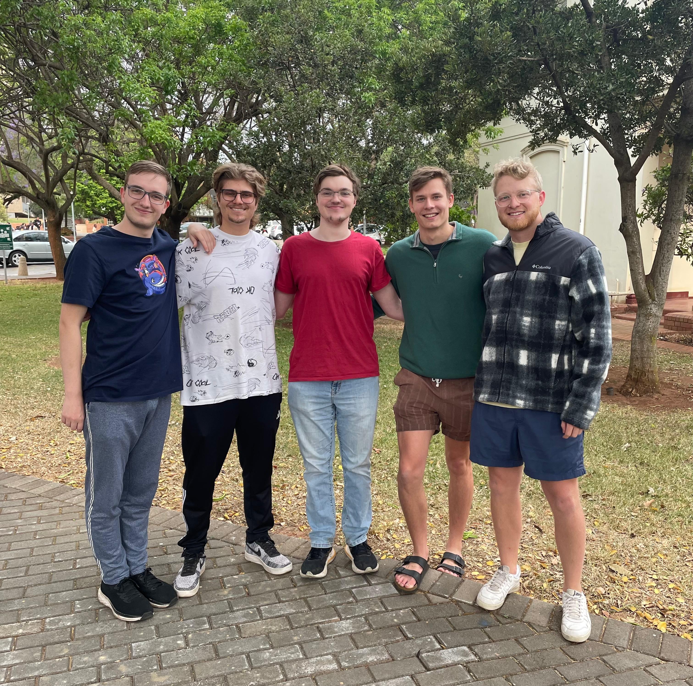

# Apollo Projects - Sign Sync

  

## Overview

Sign Sync is an innovative AI-powered communication bridge that enables seamless two-way translation between spoken language and sign language. Using advanced speech recognition, motion capture, and AI animation technologies, we're breaking down communication barriers in real-time.

### Core Functionality

- **Speech to Sign Language**: Translates spoken words into real-time, animated sign language gestures
- **Sign to Speech/Text**: Captures sign language movements and converts them into spoken words or text
- **Web Application**: Provides an intuitive, accessible platform for instant communication

## Target Audience

**Deaf & Hard-of-Hearing Community** – Enables effortless communication without needing an interpreter

**Hearing Individuals** – Helps those unfamiliar with sign language engage in inclusive conversations

**Educational & Workplace Settings** – Supports accessibility in schools, offices, and public services

**Developers & Tech Enthusiasts** – Cutting-edge project exploring AI, real-time animation, and human-computer interaction

## Why It Matters

Sign Sync isn't just a tool—it's a barrier-breaking solution that promotes inclusivity, independence, and seamless communication. By blending advanced technology with real-world impact, we're empowering users while pushing the boundaries of what's possible with AI systems.

---

## Project Demos

| Demo | Slides | Video | SRS Document |
|------|--------|-------|-------------|
| Demo 1 | [Slides](https://github.com/COS301-SE-2025/Sign-Sync/blob/main/Documentation/Demo%201/SignSync%20Demo1%20Pres.pdf) | [Video](https://drive.google.com/file/d/1HBEssni3iBMv5fkkdSIUH8-DIDpXS4gm/view) | [SRS v1](https://github.com/COS301-SE-2025/Sign-Sync/blob/main/Documentation/Demo%201/SRS%20Demo%201%20(2).pdf) |
| Demo 2 | [Slides](https://github.com/COS301-SE-2025/Sign-Sync/blob/main/Documentation/Demo%202/Sign%20Sync_%20Demo%202%20Slides.pdf) | [Video](https://drive.google.com/drive/folders/1INMoJEG3mvPEBpTpcbPcwoYKCdPumQZ8?usp=sharing) | [SRS v2](https://github.com/COS301-SE-2025/Sign-Sync/blob/main/Documentation/Demo%202/Sign-Sync_%20Software%20Requirements%20Specification%20Document%20(1).pdf) |
| Demo 3 | [Slides](https://github.com/COS301-SE-2025/Sign-Sync/blob/main/Documentation/Demo%203/Sign%20Sync_%20Demo%203%20Slides.pdf) | [Video](https://drive.google.com/drive/folders/10kwx0Bm9ss7vATdITNFWzkZnaPH7kIGk?usp=sharing) | [SRS v3](https://github.com/COS301-SE-2025/Sign-Sync/blob/main/Documentation/Demo%203/Apollo%20Projects%20-%20Software%20Requirements%20Specification%20Document.pdf) |
| Demo 4 | [Slides]() | [Video]() | [SRS v4]() |

---

## Documentation

| Document | Description | Link |
|----------|-------------|------|
| SRS Document | Software Requirements Specifications | [View](https://github.com/COS301-SE-2025/Sign-Sync/blob/main/Documentation/Demo%203/Apollo%20Projects%20-%20Software%20Requirements%20Specification%20Document.pdf) |
| Architectural Requirements | System architecture specifications | [View](https://github.com/COS301-SE-2025/Sign-Sync/blob/main/Documentation/Demo%203/Apollo%20Projects%20-%20Architectural%20Requirements%20Document.pdf) |
| User Manual | Guide for application usage | [View](https://github.com/COS301-SE-2025/Sign-Sync/blob/main/Documentation/Demo%203/Apollo%20Projects%20-%20User%20Manual.pdf) |
| Technical Installation Manual | Setup instructions | [View](https://github.com/COS301-SE-2025/Sign-Sync/blob/main/Documentation/Demo%203/Apollo%20Projects%20-%20Technical%20Installation%20Manual.pdf) |
| Coding Standards | Development guidelines | [View](https://github.com/COS301-SE-2025/Sign-Sync/blob/main/Documentation/Demo%203/Apollo%20Projects%20-%20Coding%20Standards%20Document.pdf) |
| GitHub Project Board | Team progress tracking | [View](https://github.com/COS301-SE-2025/Sign-Sync/projects) |

---

## Team Apollo

  

|**Name**|**Description**|**LinkedIn**|
|--------|---------------|----------|
| Michael Stone | Michael is an enthusiastic final-year BSc Information and Knowledge Systems student. With a strong foundation in both Computer Science and Informatics, he possesses a well-rounded skill set and a deep interest in full-stack development. His versatility enables him to contribute effectively to frontend, backend, and system integration projects. He has built several web applications and APIs, and has experience integrating them with backend systems. He enjoys working individually and alongside others, sharing ideas, and contributing to team success. Even when faced with unfamiliar challenges, Michael is committed to finding effective solutions through persistence, research, and a willingness to learn. | [LinkedIn](https://www.linkedin.com/in/michael-stone-7209b3216/)
| Matthew Gravette | Matthew is a final year BSc Computer Science student, he has completed many projects, big and small. He has extensive experience in both C++ and Java. Matthew has a deep interest in full stack web development, having built a website for auctions that could handle multiple concurrent bidders and a progressive web app for sound engineers. He strives to bring all these skills to help the team with the development of this project. He has worked in many teams of various sizes and has played both a managing role and a supporting role. He is experienced in all standard web development languages and , He is also proficient in data science and does 3rd year statistics and is well versed in database creation and management. | [LinkedIn](https://www.linkedin.com/in/matthew-gravette-0a32402ab/)
| Wj van der Walt | W.J. is a devoted full-time student with experience in full-stack development and machine learning. He is a dedicated and productive developer who leverages a wide range of tools, including GitHub, to enhance his workflow. W.J. thrives both independently and in collaborative environments, having successfully completed numerous group projects. While he enjoys all aspects of development, his true passion lies in leveraging machine learning, AI, and backend systems to solve real-world problems. As a fast and eager learner, he is confident in his ability to tackle any task assigned to him and his team. | [LinkedIn](https://www.linkedin.com/in/wj-van-der-walt-a1171a22b)
| Jamean Groenewald | Jamean is a final year BSc Information and Knowledge Systems student with a strong focus on frontend development. He has a passion for crafting intuitive and responsive user interfaces. His degree has provided a solid foundation in web development principles, and he enjoys working with modern frameworks and tools to bring ideas to life. Jamean has built several web interfaces that communicate seamlessly with RESTful APIs, emphasizing user experience and performance. He is an enthusiastic team player who thrives in collaborative settings, having worked on multiple university projects that required clear communication, shared problem-solving, and the integration of different technical components. For this project, Jamean is especially excited to contribute to the frontend architecture and API integration, ensuring the user-facing side of the application is both functional and engaging. | [LinkedIn](https://www.linkedin.com/in/jamean-groenewald-a334a5356/)
| Stefan Müller | Stefan is a versatile third-year Computer Science student with a growing interest in frontend development, system integration, and AI. While he has experience in backend technologies. His coursework has equipped him with proficiency in JavaScript, C++, and Java. Recently, he has been exploring AI and machine learning. Stefan thrives in collaborative environments, having contributed to a university group project where he worked on both frontend and backend integration for a No-SQL Database. He enjoys bridging the gap between different system components, ensuring smooth data flow and functionality. For this project, he is particularly excited to work on frontend development, API integration, and potentially AI-driven features, bringing a well-rounded perspective to the team. | [LinkedIn](https://www.linkedin.com/in/stefan-m%C3%BCller-29b3b2296/)

---

## Repository Structure

### Monorepo Architecture
This project follows a monorepo structure where all components are maintained in a single repository for streamlined development and dependency management.

### Git Branching Strategy

**Main Branches**
- `main` - Stable production-ready code
- `develop` - Integration branch for ongoing work

**Supporting Branches**
- Feature branches: `feature/frontend/feature-name`, `feature/backend/feature-name`
- Release branches: `release/v1.0`, `release/v1.1`
- Hotfix branches: `hotfix/emergency-fix`

### Development Workflow
- Code reviews are mandatory before merging to main
- Semantic versioning for consistent release numbering
- Automated testing and deployment pipelines
- Regular branch synchronization with main

---

## Code Quality & Metrics

| Category | Status |
|----------|--------|
| Test Coverage |  |
| Build Status |  |
| Code Quality |  |
| Dependencies |  |

---

## Getting Started

Interested in contributing or learning more? Check out our documentation:

- [Technical Installation Manual](https://github.com/COS301-SE-2025/Sign-Sync/blob/main/Documentation/Demo%203/Apollo%20Projects%20-%20Technical%20Installation%20Manual.pdf) - Setup instructions
- [Coding Standards](https://github.com/COS301-SE-2025/Sign-Sync/blob/main/Documentation/Demo%203/Apollo%20Projects%20-%20Coding%20Standards%20Document.pdf) - Development guidelines
- [GitHub Project Board](https://github.com/COS301-SE-2025/Sign-Sync/projects) - Team progress tracking

---

  <strong>Made by Team Apollo - Bridging Communication Gaps Through Technology</strong>

